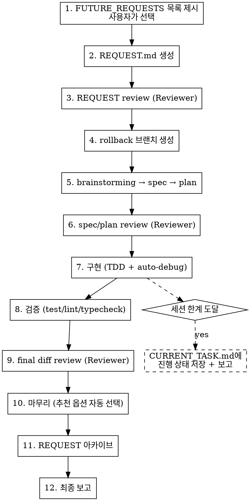

# Autopilot

FUTURE_REQUESTS에서 작업을 선택하고, 모든 리뷰를 포함한 전체 파이프라인을 자율 실행한다.

## Pipeline



## Execution Rules

### 1. 작업 선택

- `ai/workspace/backlog/FUTURE_REQUESTS.md`를 읽는다
- `validated` 또는 `ready-for-request` 상태 항목만 후보로 제시한다
- 후보가 없으면 `idea` 상태도 포함하되, 사용자에게 알린다
- **AskUserQuestion으로 목록을 보여주고 사용자가 선택한다**
- 선택된 항목의 `request seed`를 기반으로 `REQUEST.md`를 생성한다

### 2. 리뷰 — 3단계 전부 실행

모든 리뷰는 아래 패턴을 따른다:

```bash
# 세션 생성
bash ai/scripts/ai/prepare_review_pipeline.sh <review-kind> [args...]

# Claude 턴 작성 → Reviewer 턴 실행
bash ai/scripts/ai/run_review_turn.sh <session-path>
```

| 단계 | review-kind | 타이밍 |
|------|------------|--------|
| REQUEST review | `request` | REQUEST.md 생성 직후 |
| Spec/Plan review | `spec-plan [spec] [plan]` | spec + plan 작성 직후 |
| Final diff review | `diff` | 구현 + 검증 완료 후 |

**수렴 규칙:**
- 최신 Reviewer 턴이 "이의 없음"을 명시할 때까지 반복한다
- 20턴 도달 시 `awaiting-user`로 전환하고 사용자에게 보고한다
- Reviewer 피드백으로 수정이 필요하면 자율적으로 반영한다

### 3. Rollback 준비

- spec/plan review 통과 후, 구현 시작 전에 rollback 브랜치를 만든다:
  ```bash
  git checkout -b autopilot/<작업명>-<timestamp>
  ```
- 구현 중 커밋은 이 브랜치에 쌓인다
- 마무리 단계에서 merge/PR/cleanup 중 추천 옵션을 자동 선택한다

### 4. 자율 구현

- **Superpowers가 사용 가능하면 반드시 사용한다:** `brainstorming` → `writing-plans` → `executing-plans`. 사용 가능한데 건너뛰지 않는다.
- 테스트 실패, 빌드 에러 발생 시 `superpowers:systematic-debugging`으로 자율 디버깅한다
- 디버깅 3회 실패 시 현재 상태를 보고하고 사용자에게 넘긴다

### 5. 세션 한계 대응

컨텍스트 한계에 가까워지면:

1. `CURRENT_TASK.md`에 현재 진행 상태를 상세히 기록한다:
   - 완료된 단계
   - 현재 단계와 남은 작업
   - 열린 리뷰 세션 경로
   - 다음 세션에서 이어갈 명령
2. 커밋하고 보고한다: "여기까지 완료했고, 다음 세션에서 이어서 해달라"

### 6. 마무리

- **Final diff review가 완료(Reviewer "이의 없음" 명시)되기 전에는 마무리 단계로 넘어가지 않는다.**
- `superpowers:finishing-a-development-branch` skill의 옵션 중 추천을 자동 선택한다
- REQUEST를 `ai/workspace/backlog/request-archive/`에 아카이브한다
- FUTURE_REQUESTS.md 인덱스에서 해당 항목의 상태를 `done`으로 변경하고, `items/` 상세 파일에서도 status를 `done`으로 표기한다

### 7. 최종 보고

보고 파일을 `ai/workspace/reports/autopilot/YYYY-MM-DD-HHMM-작업명.md`에 저장하고, 내용을 사용자에게도 출력한다.

보고 파일 형식:

```markdown
# Autopilot 완료 보고

- 일시: YYYY-MM-DD HH:MM
- REQUEST 아카이브: `ai/workspace/backlog/request-archive/YYYY-MM-DD-HHMM-작업명.md`

## 선택한 작업
- 항목: [제목]
- 이유: [왜 이 항목을 선택했는지 — 사용자가 선택]

## 진행 과정
1. [각 단계별 요약]

## 주요 결정
| 분기점 | 선택 | 대안 | 선택 이유 |
|--------|------|------|----------|
| 마무리 방식 | [merge/PR/...] | [다른 옵션들] | [이유] |
| ... | ... | ... | ... |

## 리뷰 요약
- REQUEST review: [한줄 요약] → `ai/workspace/reports/reviews/...-request-review.md`
- Spec/Plan review: [한줄 요약] → `ai/workspace/reports/reviews/...-spec-plan-review.md`
- Final diff review: [한줄 요약] → `ai/workspace/reports/reviews/...-diff-review.md`

## Rollback
- 브랜치: `autopilot/<작업명>-<timestamp>`
- 되돌리기: `git checkout master && git branch -D autopilot/...`
```
